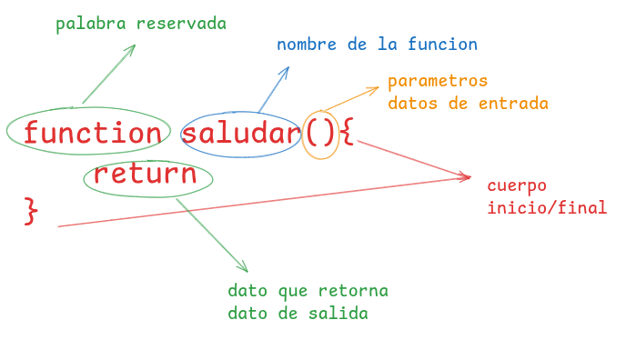

# taller de repaso de javascript
>[!WARNING]
observacion: Quokka se debe ejecutar en cada archivo

>[!tip] Quokka detecta que en nuestro proyecto tenemos nodejs y lo ejecuta para poder ver la consola en vivo 

## 1. tipos de datos
En javascript se clasifican en dos grandes grupos:
>[!tip] 
javascript tiene funciones predenterminadas por ejemplo para mostrar un mensaje por consola console.log(), para poder verificar que tipo de dato estamos manejando en javascript tmabien tenemos una funcion por defecto llamada typeo()
### Primitivos
son datos que siempre exitiran 
1. numericos
 - enteros positivos
 - enteros negativos
 - decimal negativo 
 - decimal positivo
 - 
2. texto
 - caracteres            - 10001001 - 97 - A
 - caracteres especiales - 01001001 010100101 - 256 -@
 - string
3. booleanos
  - true  - 1
  - false - 0
### Estructurados
1. Array (listas)
   - array de tipo numerico
   - array de tipo string
   - array de tipo mixto
 - como esta estructurado un array en jvascripts
  
2. objetos(diccionarios)
 aon simbolos a las listas con la unica diferencia que en vez de tner valor e indice sus elementos trabajan con clave:valor
 - como estructurado un objepto en javascript
 - 
## 2. variables constante (enlaces , bindig)
es la tecnica que se usa para poder apuntar a una dreccion en una direccion en memoria y al valor o dato relacionando o que se se encuentre almacenando en ese momento.
tenemos dos pasos para crear una variable/constante
1. primero aclarar la variable/contaste
2. segundo inicializar la variable/constate
   **observaciones** para crear una variable primero tenemos que crear el enlace luego darle el nombre de la variable/constante:para las varibales tenemos las polabras reservadas "keyword","let",var", para las constantes tenemos la palabra reservada "keyword" - "const"
   **recomendaciones** 
   - "let" usar cuando el valor tendra un avariable
   - "const" usar cuando el valor mismo simpre
   - "var" evitar usar, "let","var" ambos nos permiten - - crear variables su unica diferencia es el alcanse ambito o "scope"
   (averiguar)

## 3. operadores
Los operadores son símbolos o palabras que realizan 
Su clasificación general se devide en tres:
1. operadores unarios:             
Los soperadores unarios son  aquellos que estan ubicados a la izquierda del valor y que retornan de nuevo valor.
- operador de navegación 
1. operadores binarios:   
Los operadores binarios son aquellos que estan en medio de dos valores y que retornan un unico valor.
- operador aritmetico 
- operador de comparacion
- operador logicos 
2. operadores ternario:  
 Los operadores ternario son aquellos que evaluan tres valores y que retornan un solo valor 
## 4. conntrol de flujo
nuestros programas en javascript contienen mas de una sentencia y las sentencias son ejecutadas una a una como si fuera una historia, de arriba asia abajo como un camino recto.
### 1. control de decision (if-else)
javascript nos permite crear caminos alternativos en nuestros programas depndiendo de una decision a esto se lo conoce coomo caminos o ejcucion condicional , que ejecutara un sentancia u otra teniendo encuentra la condicion asi podemos crear multiples caminos u opciones en nuetros programas.
si tenemos un condicion verdadera se ejecutara una sentencia si tenemos una condicion false se ejecutara otra sentencia totalmente distinta.**observaiones** la ejecucion condicional rompe el flujo normal de un programa.
### 2. bucles (for) - tarea 
 Ejemplo 1: Imprimir números del 1 al 5
 ````js
for (let i = 1; i <= 5; i++) {
  console.log(i);
}
// Salida: 1 2 3 4 5
````

Ejemplo 2: Recorrer un arreglo y mostrar sus elementos
````js
const frutas = ["manzana", "banana", "cereza"];
for (let i = 0; i < frutas.length; i++) {
  console.log(frutas[i]);
}
// Salida: manzana banana cereza
````
### 3. bucles (while)- tarea con sus ejemplos en codigo 
1. Contar del 1 al 5 usando while
````js
let i = 1;
while (i <= 5) {
  console.log(i);
  i++;
}
// Salida: 1 2 3 4 5
````
2.  Sumar números hasta que la suma sea mayor a 20
````js
let suma = 0;
let num = 1;
while (suma <= 20) {
  suma += num;
  console.log(`Sumando ${num}, suma actual: ${suma}`);
  num++;
}
// Salida:
// Sumando 1, suma actual: 1
// Sumando 2, suma actual: 3
// ...
````
3. Recorrer un arreglo con while
````js
const colores = ["rojo", "verde", "azul"];
let index = 0;
while (index < colores.length) {
  console.log(colores[index]);
  index++;
}
// Salida:
// rojo
// verde
// azul
````
## 4. funciones
la funciones en javascript son bloques de codigo que se ejcuta de manera independiente,
podemos decir temabien que son mini programas que tomas datos como entra y retornan
otros datos como salida.
las funciones son fundamentales pear el correcto ordenamiento de nuestro codigo ademas que nos permite separar 
de una maner mas ordenada nuetra logica evita repetir el codigo 
muchas veces.
existen tres tips de funciones 
## tipos de funciones 
#### 1. funciones las declaraciones 
este tipo de funciones es la mas concida y as mas usada 
su estructura es la siguiente:

````js
````
#### 2 funciones por exprecion 
Función para calcular el cuadrado de un número
````js
const cuadrado = function(num) {
  return num * num;
};
````

 Función para calcular el cubo de un número
 ````js
const cubo = function(num) {
  return num * num * num;
};
````
 Uso de las funciones
 ````js
let numero = 3;
console.log("El cuadrado de", numero, "es:", cuadrado(numero)); // 9
console.log("El cubo de", numero, "es:", cubo(numero));       // 27
````
#### 3 funcion flecha (arrow punction)
1. Función flecha para sumar dos números
````js
const sumar = (a, b) => a + b;
````
 2. Función flecha para verificar si un número es par
 ````js
const esPar = num => num % 2 === 0;
````
3. Función flecha para convertir una cadena a mayúsculas
 ````js
const convertirMayusculas = texto => texto.toUpperCase();
````
Uso de las funciones
````js
console.log(sumar(5, 7));                  // 12
console.log(esPar(10));                     // true
console.log(convertirMayusculas("hola"));  // HOLA
````
## 5. metodos pra trabajar con datos estructurados
### acceder
### modificar
### crear
### insertar
### eliminar
### ordenar 